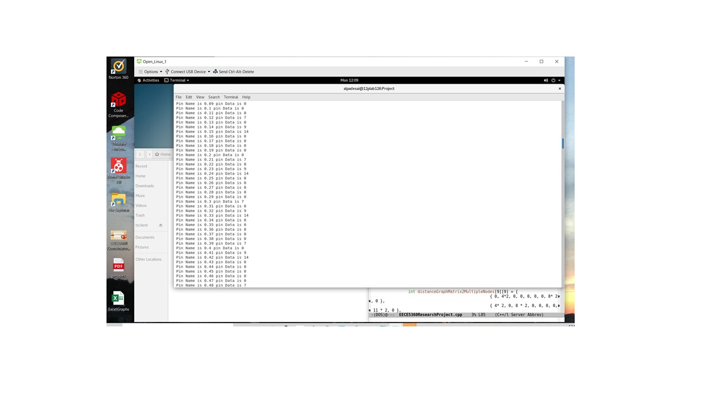
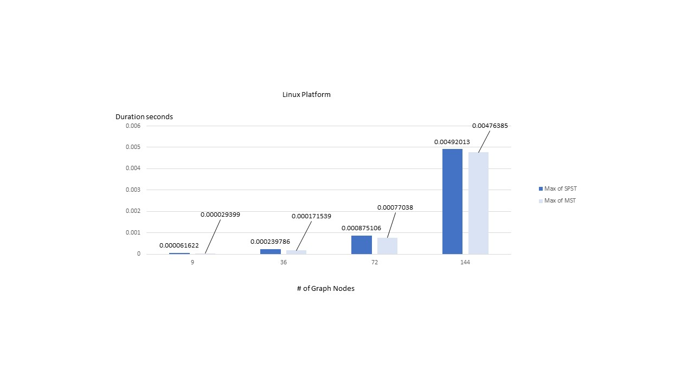
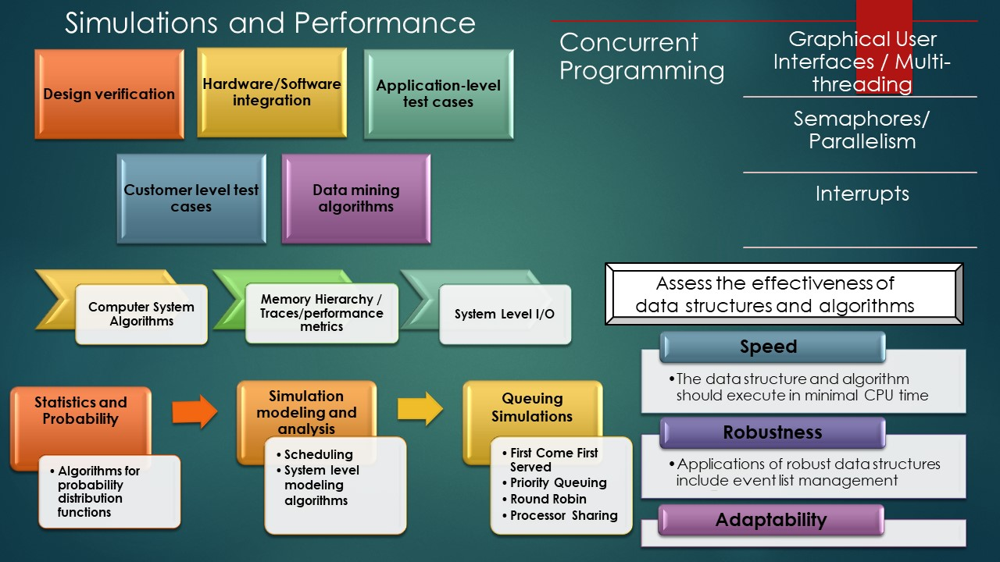
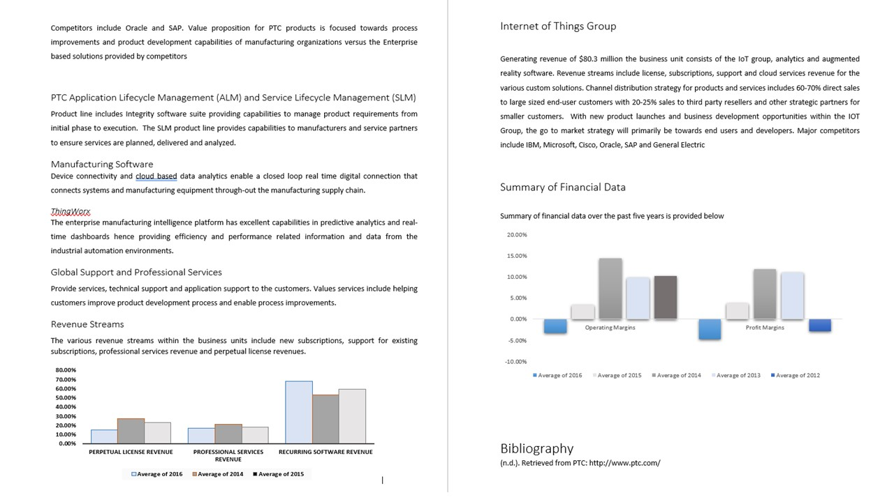

# Algorithms

The individual project provides custom Algorithms. It focuses on the CAD software for pcb designs.  

“To interconnect a set of n pins find the 'edge' or the path with least amount of length ”. Given an acyclic positive weighted undirected connected graph G = (V,E) where V = finite set of nodes or vertices with E edges find the most efficient MST algorithm in terms of CPU time and resources.  The options for the algorithms are Kruskal algorithm , Prim algorithm and Dijkstra Greedy algorithm for the shortest path. The number of node degrees (# of edges incident on it) and connectivity will can be randomized." The weight of the graph can be the length of the edge, another interesting metric would be the least impedance value from one point to the next. An alternative metric would be the least path with the least parasitic values from one pin to another. Hence this would eliminate via stubs.  However these are called constraints and might be very different from the shortest path algorithm. 
 
Confidential information is not displayed.

All images are either custom by Alpa D Desai or a reference name is provided. Most of the images and algorithms are custom by Alpa D. Desai

### Custom Algorithms - MST, SPST, Huffman, Data structures, Heapify  

### Polynomial Execution Time

## Graph theory algorithms

## Data Structures and Algorithms C/C++

## Simulation and Performance

## Ethics and Integrity

## Interest 

Further details reference : https://github.com/alpaddesai/CodingCombinatorialOptimization and https://github.com/alpaddesai/ObjectOrientedDesignProgramming
